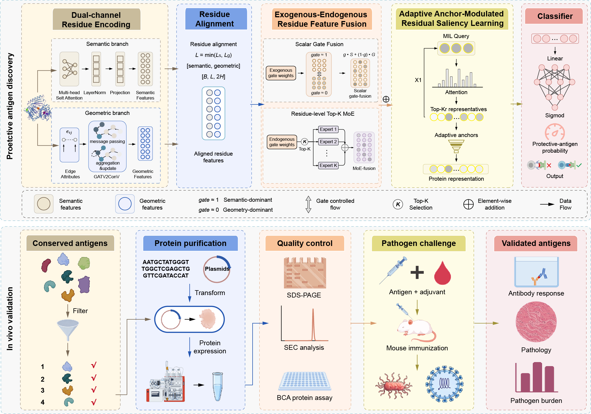

# AntigenSieve

**Residue-Level Evidence Mining for Protective Antigen Discovery and Prospective \textit{in vivo} Validation**

[](https://opensource.org/licenses/MIT)
[](https://www.python.org/)
[](https://ai4biosciences.com/AntigenSieve)

AntigenSieve is an interpretable sequence–structure learning framework for protective-antigen prediction. Unlike conventional whole-protein predictors, it mines localized evidence at residue resolution while requiring only protein-level labels for training. The model combines residue-aligned semantic and geometric representations through sparse Gate–MoE routing, then aggregates multiple localized signals with saliency-guided multi-representative attention pooling.

The framework is intended for genome-scale reverse-vaccinology workflows: it assigns each protein a protective-antigen probability and provides residue-level evidence that can support candidate ranking, epitope hypothesis generation, and downstream experimental design.



*Overview of the AntigenSieve architecture and the downstream experimental validation workflow.*

## Highlights

- **Residue-aligned multimodal fusion:** integrates SaProt-derived sequence–structure semantics with ESM-2-informed geometric graph features at single-residue resolution.
- **Sparse Gate–MoE routing:** adaptively selects the most informative experts for each residue.
- **Multi-representative MIL pooling:** preserves multiple spatially or sequentially separated predictive regions instead of compressing all evidence into one global representation.
- **Weak supervision:** learns residue-level evidence using only protein-level protective/non-protective labels.
- **Built-in interpretability:** exports residue contributions, representative-attention profiles, modality gates, and expert-routing statistics.

In the accompanying manuscript, AntigenSieve achieved a PR-AUC of **0.7134** on the PLGDL benchmark and **0.90** on the independent iBPA benchmark. All retrospectively validated protective antigens from *Brucella*, *Plasmodium*, and mpox virus ranked within the top **7.9%** of their respective proteomes. In a prospective *Mycoplasma pneumoniae* screen, 3 of 16 tested candidates significantly reduced pulmonary bacterial burden in mice.

## Model overview

1. Frozen ESM-2 embeddings provide residue-level sequence features for the geometric graph branch.
2. Foldseek structural-alphabet tokens are encoded by frozen SaProt to provide structure-aware semantic features.
3. A graph attention network propagates information through residue contacts defined from Cα coordinates.
4. Residue-aligned Gate–MoE fusion adaptively combines semantic and geometric evidence.
5. Saliency-guided multi-representative pooling aggregates localized residue evidence into a protein-level prediction.

Proteins longer than 1,022 residues are truncated to fit the 1,024-token limit of the pretrained encoders, including special tokens.

## Repository structure

```text
.
├── model.py           # AntigenSieve architecture, losses, metrics, and plots
├── train_single.py    # Stratified cross-validation training
├── test.py            # Evaluation, prediction, and interpretability export
├── process_data.py    # Sequence/structure preprocessing and feature caching
├── train_all.py       # Full-data training utility
├── ablation.py        # Ablation experiments
└── util_*.py          # Analysis and visualization utilities
```

## Requirements

A CUDA-capable GPU is recommended for feature generation and training. The main software dependencies are:

- Python 3
- PyTorch
- PyTorch Geometric
- Transformers
- NumPy, pandas, SciPy, and scikit-learn
- Biopython
- Matplotlib and seaborn
- tqdm
- umap-learn
- openpyxl
- Foldseek
- Local ESM-2 (`esm2_t33_650M_UR50D`) and SaProt (`saport_650m_af2`) model directories

`test.py` uses `utils.foldseek_util.get_struc_seq` to generate Foldseek structural tokens. Ensure that this utility is available in the repository and that the Foldseek executable has permission to run.

## Data preparation

### Training data

`train_single.py` expects a preprocessed dataset with the following layout:

```text
processed_data/
├── manifest.json
└── samples/
    ├── 00000.npz
    ├── 00001.npz
    └── ...
```

Each manifest entry must contain `id`, `label`, and `file`. Each `.npz` sample must contain `struc_emb`, `graph_x`, `edge_index`, `graph_coords`, and `label`.

The filtering workbook supplied through `--filter_excel_path` must contain two sheets named `pos600` and `neg6000`; protein identifiers are read from the first column of each sheet.

### Test data

For raw-data inference, the test workbook must contain these columns:

| Column | Description |
|---|---|
| `Protein ID (Uniprot/NCBI)` | Protein identifier used to locate its structure |
| `Sequence` | Amino-acid sequence |
| `Class` | Ground-truth class, such as `positive`/`negative` or `1`/`0` |

PDB files must be stored in one directory and named as follows:

```text
AF-<Protein ID (Uniprot/NCBI)>-F1-model_v4.pdb
```

On the first run, `test.py` generates and caches the processed features under the result directory. A later run can reuse that cache through `--processed_data_dir`.

## Usage

Run all commands from the repository root.

### Train with stratified cross-validation

```bash
python train_single.py \
  --filter_excel_path /path/to/plgdl.xlsx \
  --data_dir /path/to/processed_data \
  --save_dir ./checkpoints_single
```

By default, the script performs five-fold stratified cross-validation for up to 50 epochs, uses focal loss, and applies early stopping based on validation PR-AUC. Results are written to `checkpoints_single/<RUN_TIMESTAMP>/`; the best fold is also copied to `best_model.pth` in that run directory.

### Test and export residue-level interpretations

```bash
python test.py \
  --excel_path /path/to/test.xlsx \
  --pdb_dir /path/to/pdb_files \
  --model_path ./checkpoints_single/<RUN_TIMESTAMP>/best_model.pth \
  --esm_path /path/to/esm2_t33_650M_UR50D \
  --saport_path /path/to/saport_650m_af2 \
  --foldseek_path /path/to/foldseek \
  --save_dir ./test_results
```

The architecture arguments used for testing—including `--input_size`, `--hidden_size`, `--num_heads`, `--num_experts`, `--top_k`, and `--num_clusters`—must match the values used to train the checkpoint.

## Outputs

Training creates timestamped logs, per-fold checkpoints, metric summaries, and learning curves. Testing writes the following principal artifacts to `--save_dir`:

- `predictions.csv`: protein-level probabilities and predictions.
- `interpretability_summary.json`: residue-level scores, representative regions, gate values, and expert usage.
- `residue_contributions.npy`: per-residue positive-class logit contributions.
- `val_ids.npy`: protein identifiers aligned with the exported arrays.
- ROC, precision–recall, confusion-matrix, gate-distribution, expert-usage, UMAP, and t-SNE plots.

Residue contributions identify model-relevant positions; they should be treated as experimentally testable hypotheses rather than validated B-cell or T-cell epitopes.

## Citation

If AntigenSieve is useful in your research, please cite the accompanying manuscript:

```bibtex
@article{zhao2026antigensieve,
  title   = {AntigenSieve: Residue-Level Evidence Mining for Prospective In Vivo Discovery of Protective Antigens},
  author  = {Zhao, Yunxiang and Pan, Yunhui and Jiang, Shuyang and others},
  year    = {2026},
  note    = {Manuscript}
}
```

The citation will be updated when the final publication information becomes available.

## Web server

An interactive AntigenSieve web server is available at [https://ai4biosciences.com/AntigenSieve](https://ai4biosciences.com/AntigenSieve).

## License

AntigenSieve is released under the MIT License.
